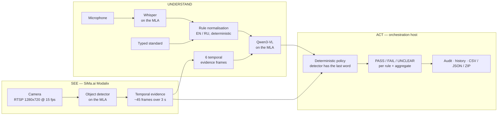

# Foreman

**Change the rule, not the model.**

A natural-language Physical AI inspection system running on SiMa.ai Modalix.

Speak or type a real-world inspection standard — *"The person must be holding a bottle."* — and
Foreman watches the physical scene and answers **PASS**, **FAIL** or **UNCLEAR**, with temporal
evidence, detector coverage, a plain-language reason and a durable audit trail.

When the requirement changes, you change the sentence. Nothing is retrained, relabelled or
redeployed.

| | |
|---|---|
| **Hackathon** | AI Infra Summit Hackathon |
| **Track** | SiMa On-Site |
| **Builder** | zsz13 |
| **Repository** | https://github.com/zsz13/sima-ai-ai-infra-summit |

---

## The problem

Visual inspection systems usually hard-code their logic. A new requirement — *"also check the cap
is on"* — typically means new labelled data, a retrained model, a redeployment, and a developer in
the loop. The perception stack and the business rule are welded together, so changing the rule
means changing the model.

Foreman separates the three concerns:

- **Perception** — what the camera and detector actually measured
- **Semantic understanding** — what the operator's sentence means
- **Policy** — how measurement and meaning combine into a verdict

Because the rule lives in the third layer, it can change in seconds without touching the first.

Realistic targets for this approach include manufacturing and packaging checks, workplace safety
and PPE validation, lab procedure adherence, warehouse operations and compliance workflows.

> This is a hackathon prototype, not a certified safety system. See [Limitations](#limitations).

---

## See → Understand → Act



**SEE** — a real camera feeds a detector running on the Modalix MLA. Every frame in the window is
measured, not just the ones shown to the model.

**UNDERSTAND** — the operator's sentence is normalised deterministically into a canonical rule. A
vision-language model is consulted only for what a detector cannot answer: relationships and
attributes.

**ACT** — a deterministic policy combines measurement and meaning. The detector is authoritative
for whether an object is present; the model may not overturn a measurement.

---

## SiMa.ai integration

The demo path runs inference **on real SiMa.ai Modalix DevKit hardware**. SiMa is the inference
platform here, not a passing mention.

| Stage | Where it runs |
|---|---|
| Object detection | **Modalix MLA** — `yolo_26n_mpk` |
| Speech recognition | **Modalix MLA** — `whisper-small-a16w8` |
| Vision-language judgement | **Modalix MLA** — Qwen3-VL (GPTQ a16w4) |
| Camera ingest | RTSP into the DevKit's GStreamer/`pyneat` pipeline |
| Orchestration, gating, policy, audit, UI | Host Mac |

The host never runs inference on the demo path. It owns the session, the gate, the grounding
policy and the audit trail, and talks to the board over a small HTTP contract (`/health`,
`/events` SSE, `/frame.jpg`, `/inspect`, `/transcribe`).

**Vision-language model.** The committed default is `Qwen3-VL-2B-Instruct-GPTQ-a16w4`.
`Qwen3-VL-4B-Instruct-GPTQ-a16w4` has been verified running on the same board and is selected with
`VLM_MODEL=`; it produces noticeably better reasons at higher latency and needs the vision stage
loaded before the detector, because its vision ELF requires a single 512 MB contiguous CMA
allocation.

**Benchmarks are never mixed.** Numbers measured on the local Mac backend are labelled `local` and
are not SiMa results. Audit records carry the backend that produced them.

---

## What it does today

Everything listed here exists in this repository and has been exercised on hardware.

**Stating a rule**
- Typed standards, and spoken standards via Whisper on the MLA
- English and Russian, both normalised to the same internal rule
- Up to **2 independent rules** at once

**Inspecting**
- **Manual mode** (default) — nothing runs until you press *Inspect now*
- **Auto mode** — a stability gate triggers inspections on its own
- **0.8 s preparation phase** before recording, so getting into position is not evidence
- **~3 s capture window**, ~45 detector frames at 15 fps
- **6 temporal evidence frames** selected across the window
- Two rules share **one capture, one detector pass and one evidence set**

**Deciding**
- **PASS / FAIL / UNCLEAR**, per rule and aggregated
- Detector grounding across the full window, not just the shown frames
- Temporal segment coverage — an object that flickers throughout is distinguished from one present
  only part of the time
- Relationship polarity — `holding(person, object)` required or prohibited
- Contradiction guard — a model that denies a measured object cannot overturn it
- Deterministic aggregation: any FAIL → FAIL, else any UNCLEAR → UNCLEAR, else PASS

**Reviewing**
- Camera Check — live detector view with an adjustable debug threshold
- Inspection history with per-rule breakdown
- Detector coverage and time-segment coverage shown honestly
- Export: **CSV**, **JSON**, and **ZIP** with evidence frames
- Append-only audit trail, tagged with the backend that produced each verdict

---

## Example rules

```
A bottle must be visible.
The person must be holding a phone.
The person must not be holding a phone.
There must be no phone in view.
```

Two rules at once:

```
Rule 1:  The person must be holding a bottle.
Rule 2:  The person must not be holding a phone.
```

### Presence is not the same as a relationship

These two sentences mean different things, and Foreman keeps them apart:

| Rule | Canonical form | A phone lying on the table |
|---|---|---|
| `There must be no phone in view.` | `cell phone.present = false` | **FAIL** — the object is prohibited |
| `The person must not be holding a phone.` | `holding(person, cell phone) = false` | **PASS** — visible is fine, held is not |

Collapsing the second into the first is a real bug class: it fails a scene that satisfies the rule,
and it cannot pass a scene where the object is absent entirely.

---

## How one inspection works

1. The operator states one or two rules.
2. Each rule is normalised **independently** into a canonical form — presence required/prohibited,
   or relationship required/prohibited.
3. Foreman captures **one** inspection window (0.8 s preparation, then ~3 s of new frames).
4. The detector measures **every** frame in the window, tracking the union of objects both rules
   need.
5. Six representative evidence frames are selected, spread across the window.
6. The vision-language model judges the relationship for each rule that needs one, over those same
   frames — each rule sees only the objects it names, so reasons stay scoped.
7. The deterministic policy produces a verdict per rule.
8. Verdicts are aggregated into one overall result.
9. Evidence frames, coverage, reasons and metrics are written to the audit trail.

For two rules: one capture, one detector pass, one shared evidence set, two independent
evaluations. Reliability is preferred over saving a model call.

---

## Backends

| Backend | Purpose | Inference |
|---|---|---|
| `modalix` | **Primary — the hackathon demo path** | Detector, Whisper and Qwen3-VL on the SiMa Modalix MLA |
| `local` | Development and testing without hardware | Runs on the host Mac; results are labelled `local` and are never quoted as SiMa numbers |
| `fake` | UI and policy work with no models at all | Synthetic harness |

The Edge API contract is identical across all three, so a bug reproduced against `fake` or `local`
is a bug in the real path too.

---

## Running it

```bash
cd foreman

./scripts/run.sh                    # modalix — the demo path (default)
./scripts/run.sh --backend local    # local models on this Mac
./scripts/run.sh --backend fake     # synthetic harness, no models
```

The backend-specific scripts can also be called directly:

```bash
./scripts/demo.sh        # modalix
./scripts/dev-local.sh   # local
./scripts/dev-ui.sh      # fake
```

The console opens at `http://127.0.0.1:8800`.

The Modalix path additionally expects a paired DevKit, the SiMa SDK container running, and the
models staged on the board — see [`foreman/docs/DEMO.md`](foreman/docs/DEMO.md) for first-time
setup and [`foreman/scripts/setup-devkit.sh`](foreman/scripts/setup-devkit.sh) for model staging.
Running without hardware is covered in [`foreman/docs/LOCAL_BACKEND.md`](foreman/docs/LOCAL_BACKEND.md).

Tests and linting:

```bash
cd foreman
uv run pytest
uv run ruff check .
```

---

## Project structure

```
foreman/
  host/        orchestration on the Mac — session, gate, grounding policy,
               rule parser, audit trail, FastAPI app
  edge/        agent that runs ON the DevKit: detector, Whisper and VLM
               calls, evidence selection (plus an optional local backend)
  frontend/    the operator console — plain HTML, CSS and JavaScript
  scripts/     launchers for each backend, DevKit setup and staging
  tests/       pytest suite for policy, parser, orchestration and exports
  docs/        demo guide, benchmarks, architecture notes, local backend
```

---

## Tech stack

**Edge (SiMa Modalix)** — SiMa MLA runtime, `pyneat`, GStreamer, quantised Qwen3-VL (GPTQ a16w4),
Whisper (`whisper-small-a16w8`), YOLO-class object detection (`yolo_26n_mpk`)

**Host** — Python 3.11+, FastAPI, Uvicorn, httpx, `uv`, pytest, Ruff

**Console** — vanilla JavaScript, HTML, CSS — no framework, no build step

**Transport** — REST over HTTP, Server-Sent Events for the live detection stream, RTSP for camera
ingest, Docker for the SiMa SDK container

---

## Limitations

Stated plainly, because a rule that silently means something else is worse than one that is refused:

- **Maximum of two rules** per inspection.
- **Relationship vocabulary is deliberately narrow.** `holding` is modelled; phrasings outside the
  supported set are surfaced as ungrounded rather than guessed at.
- **The detector's class list is fixed by its weights.** A standard naming an object outside that
  set is reported as ungrounded instead of silently ignored.
- **Negation is positional, not syntactic.** Some phrasings are known to read the wrong way and are
  documented in `host/standard_parser.py` rather than hidden.
- **Hackathon prototype.** Not a certified or production safety system.

---

## Documentation

| Document | Contents |
|---|---|
| [`foreman/README.md`](foreman/README.md) | Detailed project README |
| [`foreman/docs/DEMO.md`](foreman/docs/DEMO.md) | Running the demo, first-time setup |
| [`foreman/docs/BENCHMARKS.md`](foreman/docs/BENCHMARKS.md) | Measured latency and throughput |
| [`foreman/docs/LOCAL_BACKEND.md`](foreman/docs/LOCAL_BACKEND.md) | Running without SiMa hardware |
| [`foreman/docs/OBJECT_VOCABULARY.md`](foreman/docs/OBJECT_VOCABULARY.md) | What the detector can and cannot see |
| [`docs/ARCHITECTURE.md`](docs/ARCHITECTURE.md) | System architecture |
